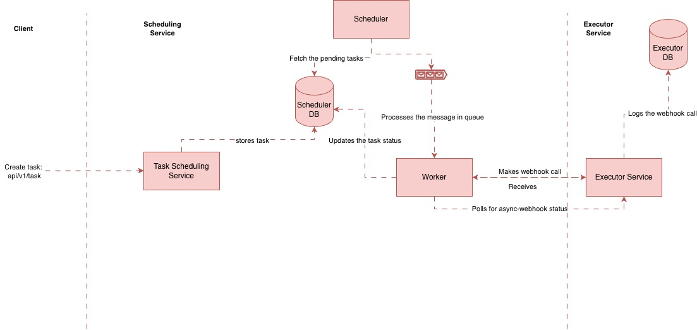

# Task Automation & Scheduling System

This project implements a production-ready, microservice-oriented backend system for scheduling and executing tasks via webhooks. It is composed of two primary services: the `Task Scheduler Service` and the `Task Executor Service`.

## System Architecture

The architecture is designed around a clear separation of concerns, ensuring scalability and maintainability.



- **Microservices:** The system is split into two independent services:
  - `scheduler-service`: Responsible for accepting, storing, and scheduling tasks. It uses Celery to manage time-based and recurring jobs.
  - `task-executor-service`: A mock business service that receives webhook calls from the scheduler, processes them, and can respond synchronously or asynchronously.

- **Databases:** Each service has its own dedicated PostgreSQL database. Database schemas are managed via Alembic and are **automatically applied** on startup.
  - `Scheduler DB`: Stores task definitions, schedules, recurrence rules, and execution history.
    - `Tables`:
      - `task_definitions`: stores the definition of the task when create API is called.
      - `task_executions`: stores the actual execution time. the scheduler picks pending tasks from here.
  - `Executor DB`: Stores the state and logs related to the actual business logic processing.

- **Recurrence:**
  - Task can be scheduled daily, hourly, custom_cron or with no recurrence.
- **Communication:**
  - Services communicate over a Docker network. The scheduler calls the executor using its service name (e.g., `http://executor:8001`).
  - **Celery & Redis:** The scheduler service uses Celery for managing background tasks. `Celery Beat` triggers scheduled jobs, which are placed onto a `Redis` message queue. `Celery Workers` then pick up and execute these jobs (e.g., calling a webhook).

- **Containerization:** The entire system is containerized using Docker and orchestrated with a single Docker Compose file at the project root. This provides a consistent and reproducible development environment.

## How to Run the System

This project is configured to run entirely within Docker containers, managed by a single `docker-compose.yml` file at the root.

### Prerequisites

- Docker
- Docker Compose

### Running the Application

1.  **Create `.env` Files:**
    Create a `.env` file inside both the `scheduler_service` and `task_executor_service` directories. Use the following templates but replace placeholder values with your actual database credentials.

    **`scheduler_service/.env`:**
    ```
    SCHEDULER_POSTGRES_USER=postgres
    SCHEDULER_POSTGRES_PASSWORD=postgres
    SCHEDULER_POSTGRES_HOST=postgres
    SCHEDULER_POSTGRES_PORT=5432
    SCHEDULER_POSTGRES_DB=scheduler_db
    REDIS_HOST=redis
    REDIS_PORT=6379
    ```

    **`task_executor_service/.env`:**
    ```
    EXECUTOR_POSTGRES_USER=postgres
    EXECUTOR_POSTGRES_PASSWORD=postgres
    EXECUTOR_POSTGRES_HOST=postgres
    EXECUTOR_POSTGRES_PORT=5432
    EXECUTOR_POSTGRES_DB=executor_db
    ```

2. **Start All Services:**
    Navigate to the project root and run the following command. This will build the images and start all containers. Database migrations will be applied automatically on startup.
    ```sh
    docker-compose up --build
    ```

3. **Interacting with the System:**
    - **Scheduler API:** `http://localhost:8000/docs`
    - **Executor API:** `http://localhost:8001/docs`

4. **Creating a Task:**
    When creating a task, use the executor's service name (`executor`) in the `webhook_url`, as the services communicate over the Docker network.
    
    **Example `webhook_url`:** `http://executor:8001/api/v1/sync-webhook`

5. **Stopping the System:**
    To stop all running containers, press `Ctrl+C` in the terminal where `docker-compose` is running, or run `docker-compose down` from the project root in another terminal.

## Manually Testing the application:
Following Curl commands can be used to create the tasks.
1. Custom Cron (async-webhook call):
```
curl -X 'POST' \
  'http://0.0.0.0:8000/api/v1/tasks' \
  -H 'accept: application/json' \
  -H 'Content-Type: application/json' \
  -d '{
  "name": "Periodic every minute task",
  "execution_time": "2026-05-30T20:46:52.371Z",
  "webhook_url": "http://executor:8001/api/v1/async-webhook",
  "payload": {
    "additionalProp1": {}
  },
  "recurrence": {
    "type": "CUSTOM_CRON",
    "cron": "* * * * *"
  },
  "max_retries": 3
}'
```

2. Hourly (sync-webhook call):
```aiexclude
curl -X 'POST' \
  'http://0.0.0.0:8000/api/v1/tasks' \
  -H 'accept: application/json' \
  -H 'Content-Type: application/json' \
  -d '{
  "name": "Hourly Scheduled task",
  "execution_time": "2026-05-30T20:46:52.371Z",
  "webhook_url": "http://executor:8001/api/v1/sync-webhook",
  "payload": {
    "additionalProp1": {
"id": 121}
  },
  "recurrence": {
    "type": "HOURLY"
  },
  "max_retries": 3
}'
```

3. Unreachable Destination URL (sync-webhook call)

```aiexclude
curl -X 'POST' \
  'http://0.0.0.0:8000/api/v1/tasks' \
  -H 'accept: application/json' \
  -H 'Content-Type: application/json' \
  -d '{
  "name": "Daily Failed Scheduled task",
  "execution_time": "2026-05-30T20:46:52.371Z",
  "webhook_url": "http://executors:8001/api/v1/sync-webhook",
  "payload": {
    "additionalProp1": {
"id": 121}
  },
  "recurrence": {
    "type": "DAILY"
  },
  "max_retries": 3
}'


```
